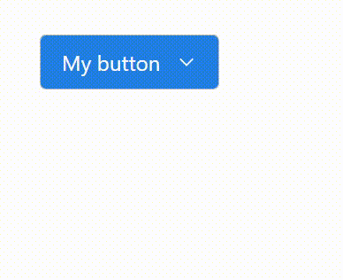

# react-dropdown-animated
A customizable dropdown menu button with simple animations for React. For those who like a little animation on your React app for some *pizzaz*.



## Installation

```bash
npm install react-animated-dropdown-button
```

## Usage
Default styling can be used with the component by including the [style.css file](.src/components/main/style.css) with

```javascript
import "react-dropdown-animated/style.css"
```

## Props

The dropdown button takes the following props:

| Prop | Type | Description | Default value |
|---|---|---|---|
| `value` | _string_  | The value of the button text. | `Dropdown button` |
| `options`  | _object[]_  | An array of objects containing the content and the callback function when the option is clicked. | `options=[{content: 'Default Option 1', onClick: (event) => console.log('Option 1 clicked!')}, {content: 'Default Option 2', onClick: (event) => {console.log('Option 2 clicked!')}}]` |
| `initial` | _number_ | The percentage value of the initial y position of the button. A higher value indicates the button moves in faster from a higher position. | `50` |
| `exit` | _number_ | The percentage value of the exit y position of the button. A higher value indicates the button moves out faster to a higher position. | `25` |
| `buttonFontColor` | _string_ | The hex code of the button font color. | `#ffffff` |
| `buttonBackgroundColor` | _string_ | The hex code of the button background color. | `#227fe3` |
| `buttonOutlineColor` | _string_ | The hex code of the button outline color. | `#8080808a` |
| `buttonBorderRadius` | _number_ | The value of the `border-radius` CSS property in pixels. | `4px` |
| `closeOnOutsideClick` | _boolean_ | If `true`, closes the dropdown menu on click anywhere outside of the menu. | `true` | 

## Development
Check out the component and help development with

```bash
git clone https://github.com/danielyuenhx/react-dropdown-animated.git
cd react-dropdown-animated
```

```bash
npm install
npm start
```